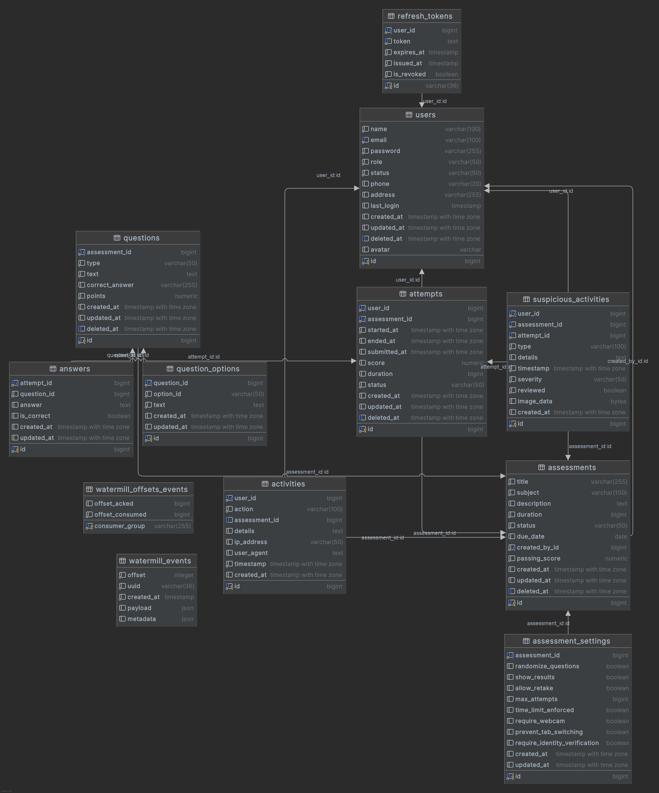
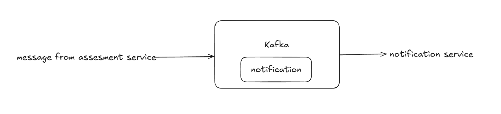

# SAP - Secure Assessment Platform

## 1. Đặt vấn đề:
- Trong bối cảnh nhu cầu thi cử tăng cao, và để đảm bảo có một giải pháp thi cử an toàn, bảo mật và hiệu quả, thì em, và các bạn đã đưa ra hệ thống SAP - Secure Assessment Service, giúp theo dõi người dùng khi thực hiện bài kiểm tra thông qua gương mặt, ánh mắt, hành vi giao tiếp, và các hành vi khác trên website của người dùng. Hệ thống sẽ đánh giá kết quả cũng như hành vi người dùng gửi về cho admin hệ thống.
- Đối tượng sử dụng: 
  - Admin: Quản lý hệ thống, người dùng, bài thi, kết quả thi.
  - User: Người dùng thực hiện bài thi.
- Mục tiêu chính:
    - Cho phép tạo và quản lý các bài đánh giá trực tuyến
    - Tạo điều kiện thi cử an toàn với các biện pháp chống gian lận
    - Cung cấp theo dõi kết quả và phân tích
    - Đảm bảo xác minh danh tính trong quá trình đánh giá
- Dữ liệu được xử lý: Dữ liêu sinh trắc học người dùng, nội dung bài đánh giá, câu hỏi, câu trả lời của sinh viên, kết quả đánh giá, dữ liệu giám sát (sự kiện webcam, hoạt động đáng ngờ trên web)

## 2. Xác định các Microservices:

| Service Name  | Responsibility                                | Tech Stack   |
|---------------|------------------------------------------------|--------------|
| auth-service   | Handles user authentication and authorization | Go, Postgres|
| assessment-service | Handle assessment, question, attempts, and results | Go, Postgres|
| notification-service | Send notifications to users | Go, Kafka, Postgres |
| gateway       | Routes requests to services                   | Nginx Ingress|
| frontend      | User interface for students and admin      | React, Vite, Bootstrap |
| message-relay | Message relay for push notification | Go, Postgres        |
| ai-service | AI service for face recognition and behavior analysis | Python, OpenCV, MTCNN, Facenet |
| proctoring-service | Proctoring service for monitoring user behavior | Go, Postgres |
---

## 3. Giao tiếp giữa các service, giữa client & service:
- Gateway ⇄ Tất cả dịch vụ: Gọi REST API.
- auth-service ⇄ client: cung cấp access token và refresh token, thực hiện quản lý user.
- assessment-service ⇄ client: REST để quản lý assessment, question, attempts, và kết quả.
- assessment-service ⇄ message relay: cung cấp thông báo cho worker để đẩy sang kafka.
- message relay ⇄ kafka: cung cấp hàng đợi tin nhắn cho các worker.
- notification-service ⇄ message relay: nhận thông báo từ message relay và gửi đến người dùng.
- notification-service ⇄ client: gửi thông báo đến người dùng qua websocket.
- frontend ⇄ gateway: gọi REST API để lấy dữ liệu từ các dịch vụ khác.
- ai-service ⇄ assessment-service: gửi dữ liệu sinh trắc
- client ⇄ proctoring-service: gửi dữ liệu vi phạm cho proctoring-service để phân tích hành vi.
---

## 4. Thiết kế dữ liệu:

- User service: Quản lý người dùng, thông tin người dùng, thông tin xác thực, sử dụng thông tin các bảng user, refresh_token.
- Assessment service: Quản lý bài thi, câu hỏi, câu trả lời, sử dụng thông tin các bảng assessment, question, attempt, answer.
- Notification service: Quản lý thông báo, sử dụng thông tin các bảng watermill_offset_event, watermill_offset, suspisious_activities.
- Message relay: Quản lý hàng đợi tin nhắn, sử dụng thông tin các bảng watermill_offset_event, watermill_offset.
- Proctoring service: Quản lý các hành vi đáng ngờ, sử dụng thông tin các bảng suspicious_activities, user.
- AI service: thực hiện lưu thông tin duy nhất sinh trắc học (face_id) của bảng user.
---

- Kafka: Quản lý hàng đợi tin nhắn, sử dụng bản ghi từ message_relay forward được từ postgres qua topic: notification.

## 5. Vấn đề bảo mật:
- Xác thực dựa trên JWT với cơ chế refresh token, có khả năng ngắt phiên sau khoảng thời gian ngắn.
- Kiểm soát truy cập dựa trên vai trò (Quản trị viên, Sinh viên) (RBAC).
- Mã hóa mật khẩu và thông tin nhạy cảm trong cơ sở dữ liệu (Hash).
- Xác minh danh tính dựa trên webcam.
- Các biện pháp chống gian lận (phát hiện chuyển tab, giám sát khuôn mặt).
- Ghi nhật ký và cảnh báo hoạt động đáng ngờ.
- Phiên làm bài có giới hạn thời gian, được bảo vệ dưới server.
- Đều thực hiện phân quyền (authorization) và xác thực (authentication) trên tất cả các API cần bảo vệ.
- Sử dụng HTTPS để mã hóa dữ liệu trong quá trình truyền tải (TLS).
- Sử dụng firewall để giới hạn truy cập vào các dịch vụ nội bộ.
---

## 6. Qui trình deploy và phát triển:
- Mỗi microservice được đóng gói bằng Docker (containerized bằng từng Dockerfile).
- Sử dụng Kubernetes để quản lý và triển khai các dịch vụ.
- Pipeline CI/CD để tự động hóa kiểm thử (unit-test) và triển khai (deploy trên cloud). (dự kiến)
- Cấu hình môi trường thông qua ConfigMaps và Secrets
- Mở rộng theo chiều ngang cho assessment-service, ai-service vì tiếp nhận nhiều request trong thời gian cao điểm đánh giá (replica).
- Có thể mở rộng theo nhiều node.
- Với môi trường local: sử dụng docker-compose để khởi động các dịch vụ và cơ sở dữ liệu.
---

## 7. Kiến trúc hệ thống
![](https://kroki.io/mermaid/svg/eNqVV21P4zgQ_p5fEWW1EkjmEOJW4ljpJNoC16NF3bYcJwV0clMnjQhOZTvb5d-f3xK_xC2Qfmgy88x4Xu1xQeB2Ey8HUcyfr1_jYVUizOIJfENE0mizKiQmsVmJ5IlHUdOWOyD1jnL-cweYonUJZ-UWpYl8jcX7Ez7SyGML-jBOkzmCGTu9wkVTQfKEb0iNGcJrC-UtHZ-cnHDJELVbWjK5lqiT565ezcbxLWRoB9-C_vb4xmlNTh3M0f3t-P5f25_JIE0mNVzHA1hBnDlheby6SZNHtIqvttuqzCAra8zdLQnXVVUhd9t1hGeTQZDMlQZdXSDys8xQ0E2HZ1wUAWrYphXt6FZ8LLaRE4_gpC7_uQcY8sSSuqoQ0VBD8NAPvEy0njQRH3u0LusXhDug_NqD7Bkjo-dadcBgVXLGqvegtmEdts2RY4-IOqWI0ldRwwdi3wN5Gej4aQj7HAA7-TAie7Pyo0FUFG0X8JawZ5U5ok3FOrT6_FB-jDEyS561B12REp6l7ws4pr6fsPGhRI33JIhvdRbPdX-EGMqExde4KDEPVkeIFcXDT-s1qrrITieKsC_bGFZvrMxoq7wjhJV7ZssAeQaGILZNIb5nxrtRvq9Zmet98kC8QzA38jYiDePdAPBNelFnL4hNIYaFaI-OEmuSJ2Er5cXXIG8dSTsUZgctN3bPhsPo3vq96PoHxAgyGDwdDMM5GhYlLiokxVaQGv2zmrKCIDoapEeJ_lj8mHTA5Pg5mN0hzDZcZWQ2i3VJxSbB_yQTJWHBKe9eHhAxd7xYYbmD-QtME_n3juQcVfDNmlYkVRLFwGJh-MxyU5MdJGsztfhxHOOcQMpIk7GGhM_bEMTE9u6Cu33XrBDBvMe471VDmVNgM1K_IrZBDQea9yc8rXHJasKjaIFvCcx5xaSJfnnCI0g3q5o7Qfe4wPdCrJqbxivEdoifopUwkkbOeBUnfy2Xs8Xp_HqxTPj3n-0kEjlTn0Ty8p0vh6dq_lswguCrElHazPpmmIkTo1gcqYfY3QHRA3V9o5B2Y_QVoqKUsQ5DI2tW4MPw_GGkgKbko95p9XGc8Oa0mM-G2iU1z8q98oASzybRJ-pTThxUycgmCtom8eqw62GjwM4SJ7OmquLrn1yDFpAdFvmdI7G6WXyccUGiFs2KZqRciSvBcANxoXYV3vRb0R_HStxWfqjhMlO8Vmx-EwZc9GPg0Mfut-u6zbEdsOnSRZcU6ZZWVNOtkdvIiq1b1B3ctygTZsQUZQ0p2Rv38HVbY5EAiYHcwf92ME-Tvx-X8T-wKtfSZN3c9uWghZoFsgpSOkI5f5FNnZdVdfkl_0P8AA8qL6LLL-fn5_r9ZFeu2ebybPvruyte6FW0_Dfx-4w81VcQJY_OuDz6jPxany6tgov8G_qUA6VbRdqPPL9AZ59Rk8mG0tLn6JNReFU1vpInWaslQ7-j7ANajCq9p4JuBwYPY51ga8G2MsBkAPitEbTF0ebShoomAu61Bli3H2Bfb4DpL-DP1sAbxIEzZ4OrMfDmSmAPkcCbGIHdocAfkEBvBmqrzPbMauW2hmw271xguhToBvWqxRZQ84osA0eP2BmAs0E6yf7-P4zJHco)

## Tổng kết
- Khả năng mở rộng: Hệ thống có thể mở rộng các thành phần riêng lẻ dựa trên nhu cầu (ví dụ: proctoring service khi có lượng tham gia làm bài cao).
- Cô lập: Tách biệt các mối quan tâm như xác thực, quản lý đánh giá và giám sát cho phép phát triển và triển khai độc lập.
- Khả năng phục hồi: Nếu một service gặp sự cố, nó không nhất thiết làm sập toàn bộ nền tảng.
- Linh hoạt công nghệ: Các service khác nhau sẽ có các công nghệ phù hợp khác nhau, VD: AI service có thể sử dụng Python, trong khi các service khác có thể sử dụng Go.
- Phát triển độc lập: Các thành viên có thể tập trung vào các dịch vụ khác nhau mà không làm gián đoạn công việc của nhau.
- Khả năng bảo trì: Các codebase nhỏ hơn, tập trung dễ hiểu và bảo trì hơn các ứng dụng monolithic, đồng thời dễ update các service với cơ chế điều phối của k8s.

## Những người đóng góp project này:
- **Backend Developer**: Bui Duy Khanh.
- **AI Engineer**: Nguyen Lam Kien, Nguyen Khoi Lam.
- **Frontend Developer**: Do Quang Tuan.
